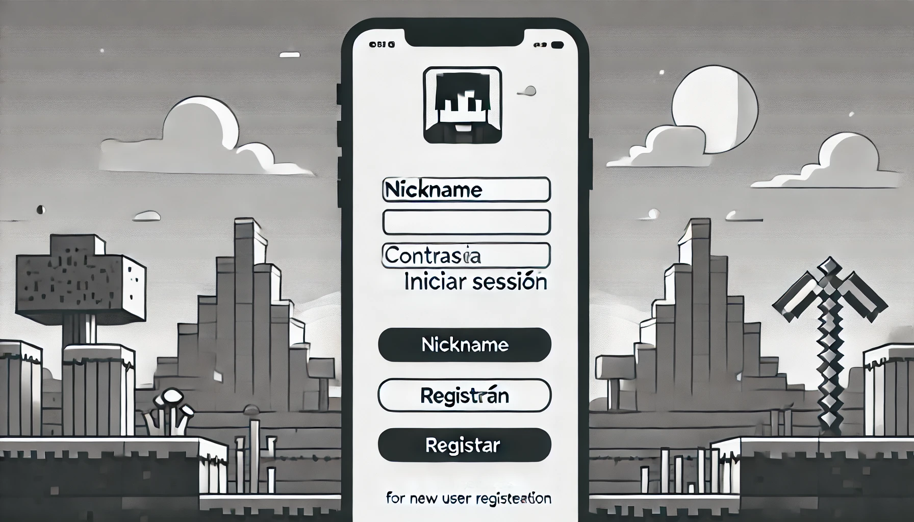
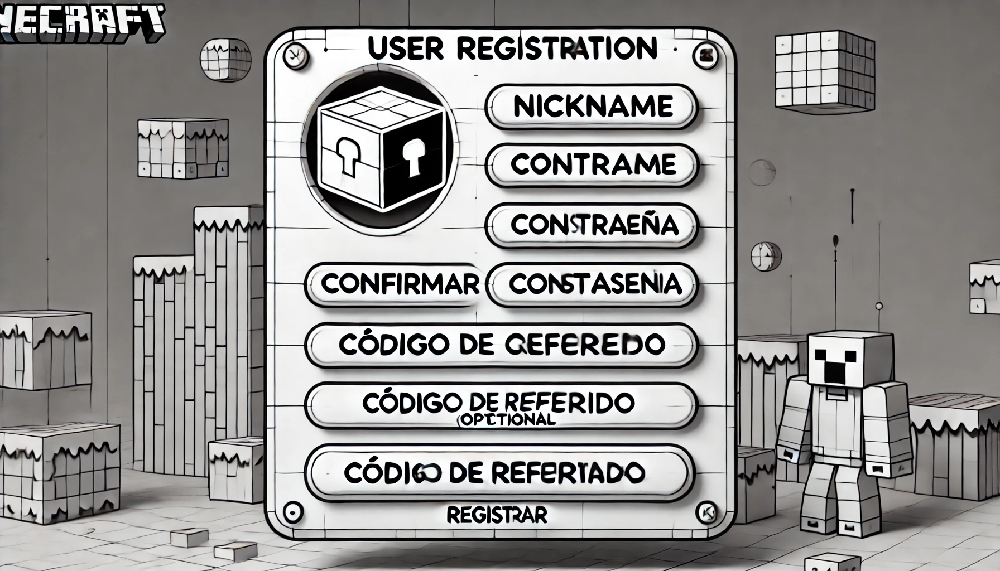
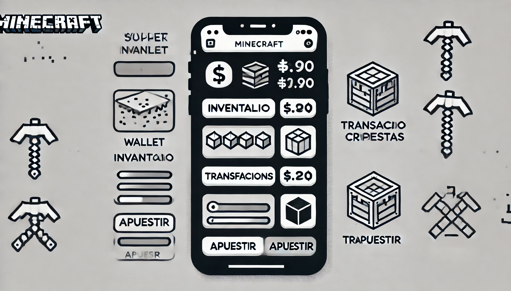
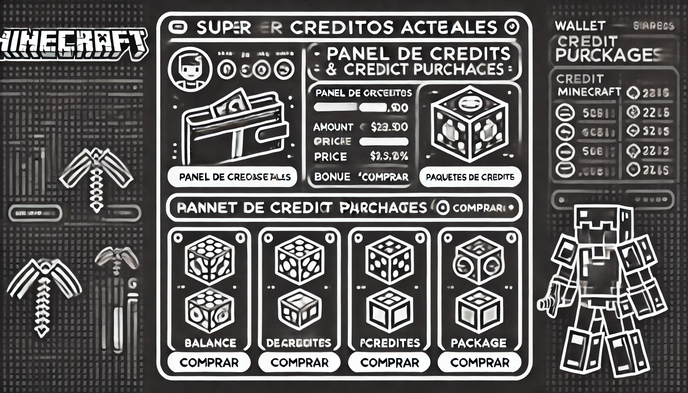
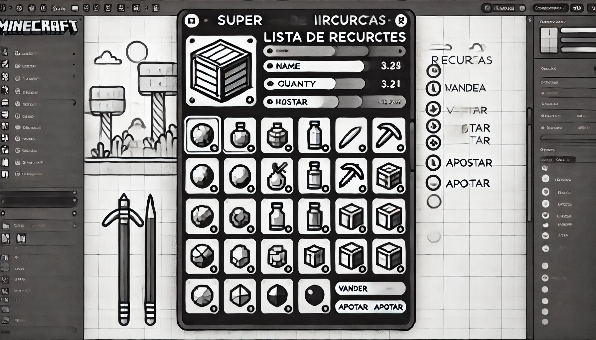
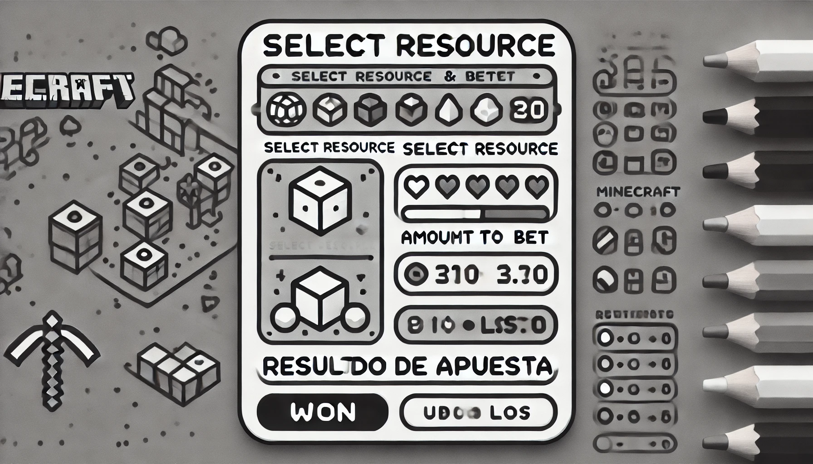
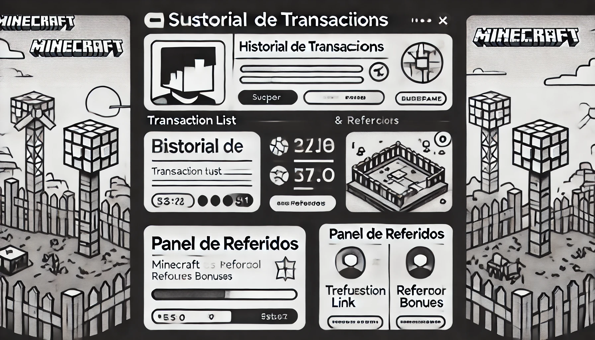

# 🖼️ Wireframes y 📝 Explicación de Interfaces

Este documento incluye los wireframes de las principales interfaces de usuario del sistema de compra, venta y apuesta de recursos para Minecraft, junto con una explicación detallada de cómo los 👤 usuarios interactuarán con el sistema.

---

## 📋 1. Pantalla de Inicio de Sesión (Login)

### Descripción:
- **Campos**: Nickname y Contraseña.
- **Botón de Inicio de Sesión**: Permite al usuario autenticarse en el sistema.
- **Enlace de Registro**: Redirige a la pantalla de registro para los nuevos usuarios.

### Interacción:
1. El usuario ingresa su nickname y contraseña.
2. Al hacer clic en "Iniciar Sesión", el sistema valida los datos y, si son correctos, lo redirige a la pantalla principal.

---

## 📋 2. Pantalla de Registro de Usuario

### Descripción:
- **Campos**: Nickname, Contraseña, Confirmación de Contraseña y Código de Referido (opcional).
- **Botón de Registro**: Permite completar el proceso de registro y crear una cuenta.

### Interacción:
1. El usuario completa los campos requeridos.
2. Al hacer clic en "Registrar", el sistema crea la cuenta, vincula la wallet inicial y redirige al usuario a la pantalla de bienvenida.

---

## 📋 3. Pantalla Principal

### Descripción:
- **Barra de navegación**: Incluye acceso a la wallet, inventario, transacciones y apuestas.
- **Panel de Créditos**: Muestra el saldo actual de créditos del usuario y un botón para comprar más créditos.
- **Opciones de Transacción**: Permite al usuario iniciar compras, ventas o transferencias de recursos.

### Interacción:
1. El usuario puede visualizar el saldo de su wallet.
2. Accede a opciones para comprar, vender o transferir recursos.
3. Puede navegar entre las secciones para gestionar su inventario, ver transacciones y realizar apuestas.

---

## 📋 4. Pantalla de Wallet y Compra de Créditos

### Descripción:
- **Panel de Créditos Actuales**: Muestra el saldo actual de créditos.
- **Sección de Paquetes de Créditos**: Lista de paquetes disponibles para la compra, cada uno con detalles de precio y bonificación.
- **Botón de Compra**: Permite adquirir un paquete específico de créditos.

### Interacción:
1. El usuario selecciona un paquete de créditos.
2. Al hacer clic en "Comprar", el sistema procesa la compra y añade los créditos a la wallet del usuario.

---

## 📋 5. Pantalla de Inventario

### Descripción:
- **Lista de Recursos**: Muestra los objetos que el usuario posee en su inventario, junto con la cantidad y valor de cada uno.
- **Acciones Disponibles**: Opción de vender o apostar recursos seleccionados.

### Interacción:
1. El usuario revisa su inventario.
2. Puede seleccionar un recurso y optar por venderlo o apostarlo.

---

## 📋 6. Pantalla de Apuestas

### Descripción:
- **Selección de Recursos**: Permite al usuario elegir un recurso y la cantidad a apostar.
- **Panel de Resultados**: Muestra el resultado de la apuesta (ganado o perdido) y actualiza el inventario del usuario.

### Interacción:
1. El usuario selecciona el recurso y la cantidad que desea apostar.
2. Al hacer clic en "Apostar", el sistema calcula el resultado y ajusta el inventario y créditos según el resultado de la apuesta.

---

## 📋 7. Pantalla de Transacciones y Referidos

### Descripción:
- **Historial de Transacciones**: Lista de transacciones realizadas, incluyendo compras, ventas, transferencias, y apuestas.
- **Panel de Referidos**: Muestra el enlace único de referido del usuario y estadísticas de referidos.
- **Bonificación de Referidos**: Indica la cantidad de créditos ganados a través del sistema de referidos.

### Interacción:
1. El usuario puede revisar el historial completo de transacciones.
2. Puede copiar su enlace de referido y consultar la bonificación acumulada.

---

Estas interfaces están diseñadas para ser intuitivas y facilitar el flujo de actividades del usuario, promoviendo una experiencia de juego estructurada y atractiva.
